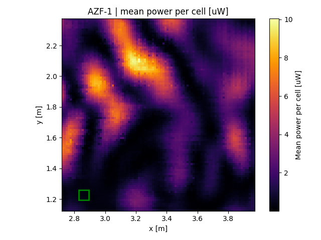
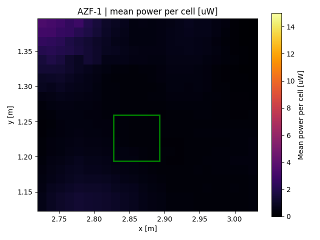
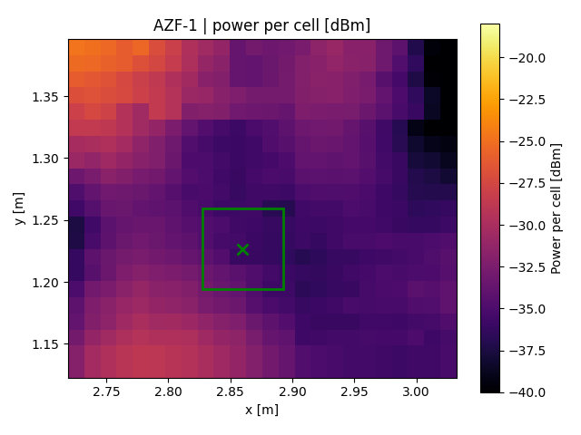
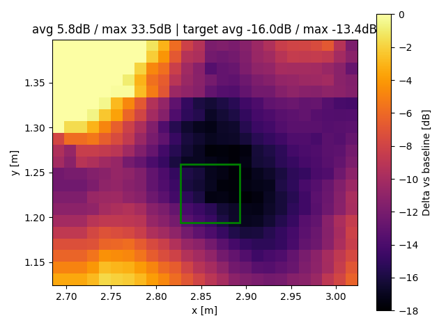
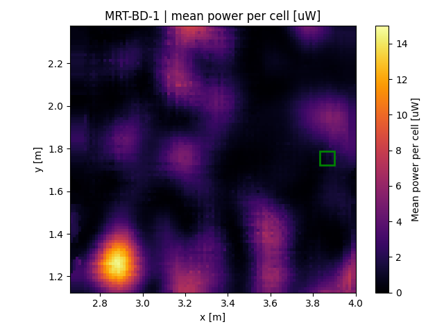
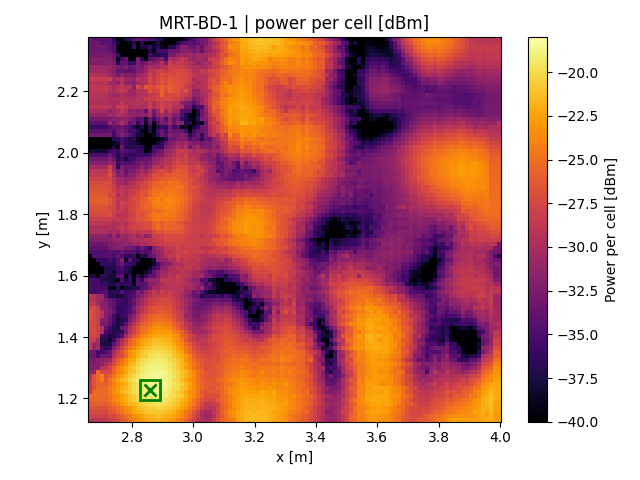
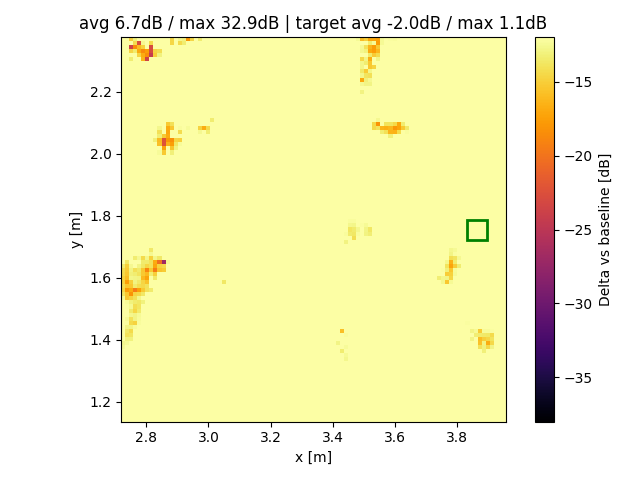
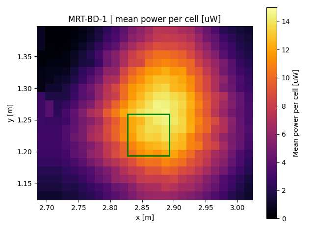
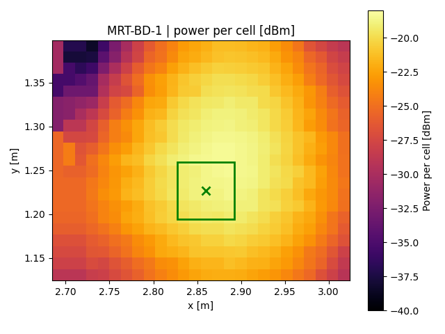
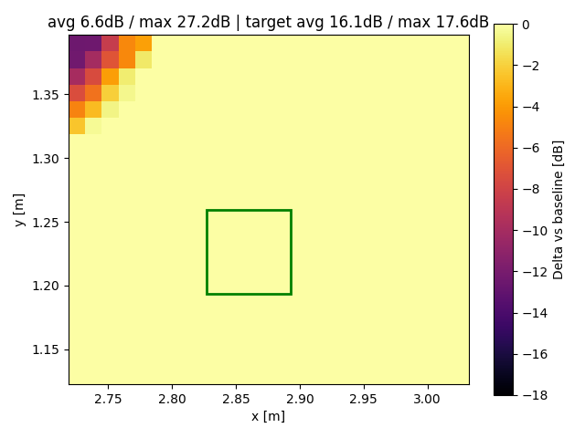

# DLI Supression Experiment

Short guide to the scripts used in this repo and the datasets currently stored under `data/`.

## Core scripts

- `server/record/record-meas-scope.py`
  Records scope power during positioner scans and saves snapshots in `data/<FOLDER>/` as:
  - `*_positions.npy`
  - `*_values.npy`
  - `*_bd_power.npy` (bd channel, stored in pW)

- `processing/plot_all_folders_heatmap.py`
  Aggregates all runs per data folder and produces heatmaps plus CSV/TEX exports. It supports:
  - uW heatmaps and dBm heatmaps
  - baseline delta plots in dB
  - zoomed plots around `target_location` (from `experiment-settings.yaml` or `data/<folder>/config.yml`)
  - per-folder overrides via `data/<folder>/config.yml` (e.g., `cmin/cmax`, `vdmin/vdmax`, `baseline-folder`)

- `client/run_reciprocity.py`
  Runs reciprocity measurements on the client side using the configured USRP and settings.

- `client/usrp_pilot.py`
  Pilot/PLL loopback and phase-difference measurements for calibration and sanity checks.

- `server/record/sync-BF-server.py`
  Synchronization and coordination server (ZMQ) for beamforming/GBWPT experiments.

## Data folders

Measurements currently stored in:

- `data/AZF-1/`
- `data/MRT-BD-1/`

Each folder can include a `config.yml` with plotting overrides and `target_location`.

## Images

| Dataset | uW heatmap | dBm heatmap | Delta vs baseline (dB) | Zoom uW | Zoom dBm | Zoom delta (dB) |
| --- | --- | --- | --- | --- | --- | --- |
| AZF-1 |  |  |  |  |  |  |
| MRT-BD-1 |  |  |  |  |  |  |
