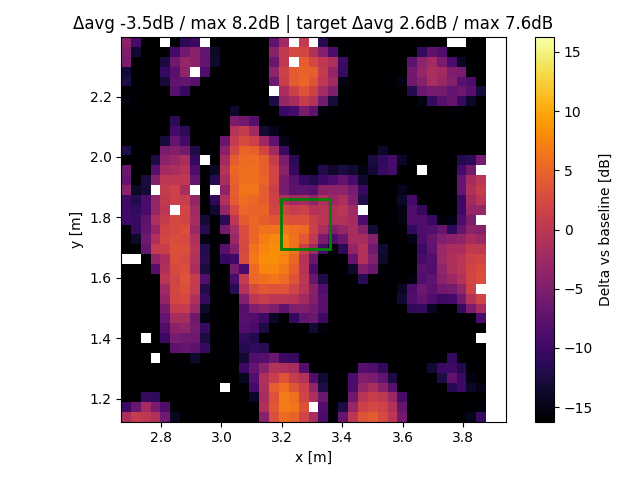
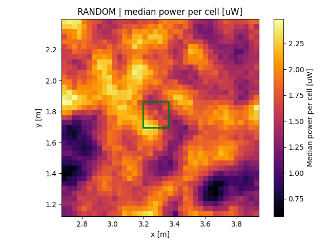
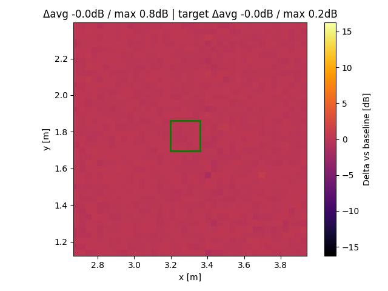
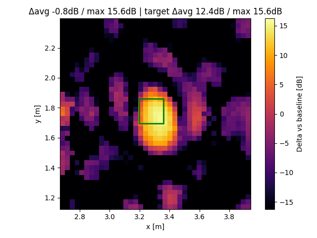
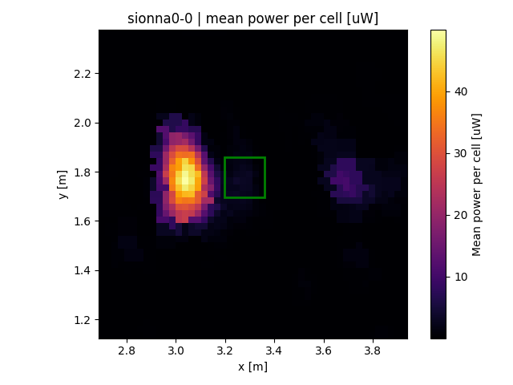
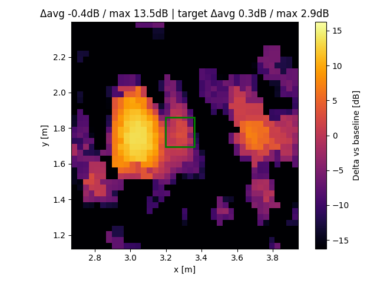

# Data Heatmaps

Heatmaps saved alongside each measurement series. Generate them with:
```
cd ..
python processing/plot_all_folders_heatmap.py --plot-all
```

| Folder | Heatmap | Baseline vs RANDOM (dB) |
| --- | --- | --- |
| energy-ball-A |  |  |
| RANDOM |  |  |
| RECI-0 |  |  |
| sionna0-0 |  |  |

## Archived runs
- Older plots and runs with bad REF/LB sync were moved to `data/arxiv/`; associated plots were removed from this README.
